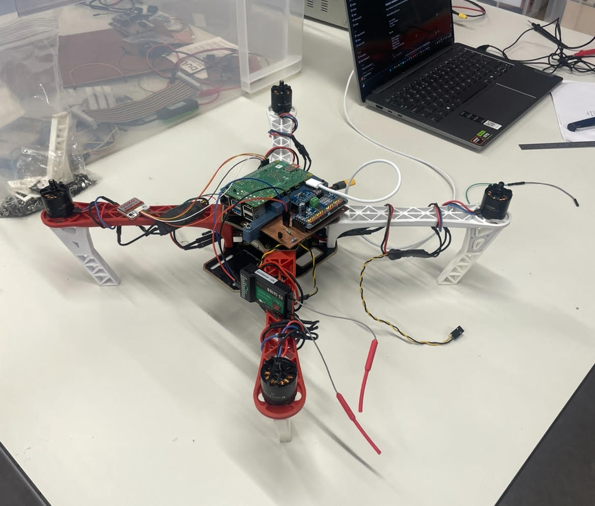

# EDUCOPTER

<p align="center">
  
</p>

Welcome to the **EDUCOPTER GitHub repository**.

This project has been developed based on the work of the **OBAL project**, which demonstrated that a Raspberry Pi can be used as the single flight computer for a custom ArduPilot flight controller. Thanks go to **Mohammad Hefny** for his contribution to custom Linux flight controller developement.

EDUCOPTER builds upon this foundation with the goal of creating a **simpler, highly replicable custom flight controller designed specifically for education and experimentation**.

---

# What is EDUCOPTER?

**EDUCOPTER** is a minimal **ArduPilot-compatible quadcopter platform** designed to be easily reproduced by students, researchers, and hobbyists.

Unlike many flight controller designs that prioritise performance or compactness, EDUCOPTER prioritises **simplicity and reproducibility**.

Key characteristics of the design include:

* A **Raspberry Pi–based Linux flight controller**
* A **single-sided PCB** for easy manufacturing
* Only **essential sensors and actuators** required to fly with ArduPilot
* A complete set of **documentation and instructions** allowing others to replicate the project from scratch with little experience in this area

The project demonstrates how a fully functional ArduPilot drone can be built with **minimal hardware complexity**, while still providing a powerful and flexible autopilot platform.

---

# Project Goals

The EDUCOPTER project aims to:

* Provide a **simple reference design** for a Linux-based ArduPilot drone
* Enable **students and educators** to build and understand a flight controller
* Demonstrate how **ArduPilot can run on custom hardware**
* Provide **clear instructions and documentation** for full system replication

---

# Repository Structure

This repository is organised into several sections to make it easy to understand and reproduce the project.

```
EDUCOPTER/
├── software/
├── hardware/
├── BOM/
└── flying/
```

Each section contains documentation and files required for a specific stage of the project.

---

# Software

The **software** section contains all code and configuration required to run ArduPilot on the EDUCOPTER flight controller.

This includes:

* Modified or configured ArduPilot code
* Supporting scripts and configuration files
* Instructions for installing and running the software on the Raspberry Pi

A detailed README inside this folder contains instructions for software implementation and **must be read**. It explains:

* Raspberry Pi setup and connection
* Linux Virtual Environment setup
* Compiling ArduPilot
* Configuring the EDUCOPTER board
* Connecting to ground control software
* Running the firmware and testing

```
software/
└── README.md
```

---

# Hardware

The **hardware** section explains how to construct the EDUCOPTER flight controller board.

This includes:

* PCB gerber files and images
* Circuit schematics
* Instructions for manufacturing the board
* Guidance for soldering components and assembling the hardware

The hardware README provides **step-by-step instructions** for building the EDUCOPTER board.

```
hardware/
└── README.md
```

---

# Bill of Materials (BOM)

The **BOM section** contains a complete list of components required to build both the EDUCOPTER flight controller and the final drone platform.

This includes:

* Electronic components used on the board
* Sensors and connectors
* External drone components such as motors, ESCs, frame, and power distribution board

These parts are included primarily for completeness; compatible alternatives may be used where appropriate.

```
BOM/
└── BOM.xlsx
```

---

# Flying the Drone

The **flying** section demonstrates the final stage of the project.

This section contains:

* Images of the completed drone
* Instructions for connecting all components
* Guidance on flight configurations
* Steps for synchronising the radio controller, sensors, and motors
* Instructions for performing the first flight

```
flying/
└── README.md
```

### Example Flight Images

*(Insert images here)*

```
[Image placeholder – completed drone]

[Image placeholder – drone in flight]

[Image placeholder – system setup]
```

---

# Replicating the Project

This repository has been structured so that users can **follow the entire process from start to finish**, including:

1. Building the flight controller hardware
2. Installing and configuring the software
3. Assembling the drone platform
4. Performing system calibration and first flight

All necessary documentation is provided within the repository.

---

# Acknowledgements

This project builds upon the work of the **OBAL project** and the wider **ArduPilot community**.

Special thanks to **Mohammad Hefny** for his contributions to the OBAL platform and for enabling Linux-based flight controller development.

---

# License

This project follows the licensing terms of the software and tools it builds upon. Please refer to the relevant directories for detailed licensing information.
