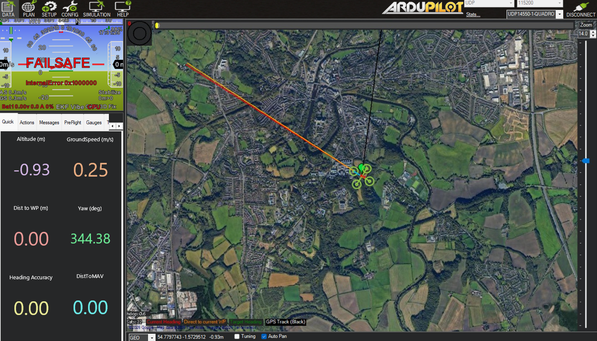
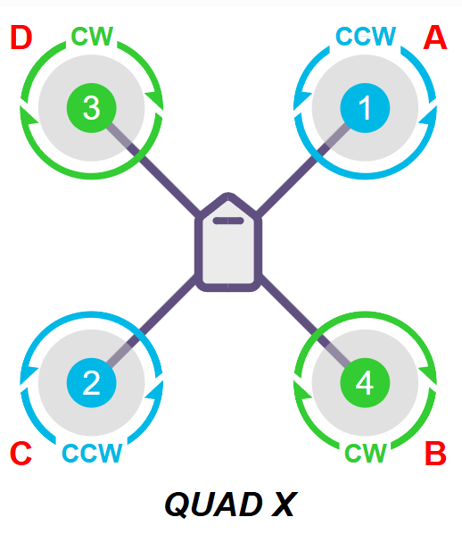

# Assembling the EDUCOPTER Quadcopter

With the EDUCOPTER board successfully built and the EDUCOPTER binary installed along with MAVProxy and the system service files created, you're now ready to build the drone. Ensure the Raspberry Pi is connected to the EDUCOPTER board and follow these steps in order.

## 1. Installing the Holybro Power Distribution Board

Place the **Holybro PM07 power distribution board** inside the drone frame base plate.

Plug the four ESC power leads into the ports of the Holybro board.

Ensure:

- polarity is correct
- connections are secure
- cables are not under tension
- space is left above the board for mounting the EDUCOPTER controller

Insert image here

---

## 2. Mounting the EDUCOPTER Flight Controller

Fix the EDUCOPTER board to the top of the drone frame using a **3D printed mounting structure** designed for your frame geometry.

An example mounting structure is shown below.

Insert image here

Ensure:

- the board is rigidly mounted
- the IMU is firmly secured and can't wobble or vibrate
- the Raspberry Pi USB-C port remains accessible

Loose IMU mounting will cause incorrect attitude estimation during flight and control issues.

---

## 3. Connecting the GPS and RC Receiver

Connect the GPS module and RC receiver to the EDUCOPTER board.

Connections:

- GPS → 4 pin header with 5V, GND, RX, TX
- SBUS receiver → 3 pin header with GND, 5V, SBUS

Ensure that the cables connect to the correct corresponding pins by referring to the circuit schematic and gerber files. The GPS RX must connect to the Pi TX pin, and the GPS TX to the Pi RX.

Insert image here

---

## 4. Connecting ESC Signal Outputs to the PCA9685

Attach the ESC signal wires to the signal and ground pins of the PCA9685.

ESC numbering follows the PCA9685 channel order from left to right:

- ESC 1 → Channel 0
- ESC 2 → Channel 1
- ESC 3 → Channel 2
- ESC 4 → Channel 3

The **QUAD-X motor configuration must be followed**.

Insert diagram here

Incorrect ordering will prevent stable flight.

---

## 5. Mounting the Motors

Attach the motors to the drone frame arms using the supplied nuts and bolts.

Once mounted, connect each motor to its ESC.

Do not attach propellers yet.

Motor rotation direction will be verified later during calibration.

---

## 6. Installing the Battery and Power Connections

Attach the battery to the underside of the drone frame. It is recommended to do this using a velcro mechanism so batteries can be easily substituted if needed, but any connect will suffice.

Connect the power splitter to the battery output, and connect the USBC to the Pi and the other connector to the power distribution board. 

Insert diagram here

The Pi should power on, the PCA will hold a solid red light and the GPS and RC receiver should light up. It is recommended at this point to ssh to the Pi so that it can be easily shutdown if errors occur.

---

## 7. Performing ArduPilot Calibration

Once assembly is complete, calibration can begin using Mission Planner.

Complete the following calibrations:

- accelerometer calibration
- compass calibration
- RC calibration

This can be done in the setup section of Mission Planner, where detailed instructions are located.

ESC calibration depends on ESC type. The standard ArduPilot ESC calibration process works for most ESCs but should be checked against manufacturer documentation before use.

---

## Testing RC Outputs Before Flight

Ensure propellers are **not attached** before testing.

Arm the throttle using either:

the MAVProxy command

arm throttle

or by holding the RC throttle hard left for several seconds.

Test outputs by adjusting:

- throttle
- yaw
- pitch
- roll

Observe PWM outputs from the PCA9685 channels.

---

## Verifying Motor Rotation Direction

Using telemetry dash board in Mission Planner, tilt the drone in the x and y direction until the pitch changes. This can be used to find the forward direction of the drone. Alternatively, rotate the drone until the yaw reads 0 degrees. The front of the drone will now be facing North.

This will help to determine the correct motor rotation directions.

Use the Mission Planner motor test function to confirm correct motor rotation.

Expected QUAD-X rotation directions:

- front right → clockwise
- front left → counter-clockwise
- rear left → clockwise
- rear right → counter-clockwise

If rotation is incorrect, swap any two ESC-motor wires.

---

## First Flight

Once calibration and testing are complete, attach the propellers.

Move to an open outdoor space before attempting flight.

Before take-off confirm:

- battery secure
- GPS lock achieved
- transmitter connected
- failsafe configured
- correct flight mode selected

Set the initial flight mode to:

STABILIZE

Ensure compliance with local drone regulations before flying.

Happy flying!
