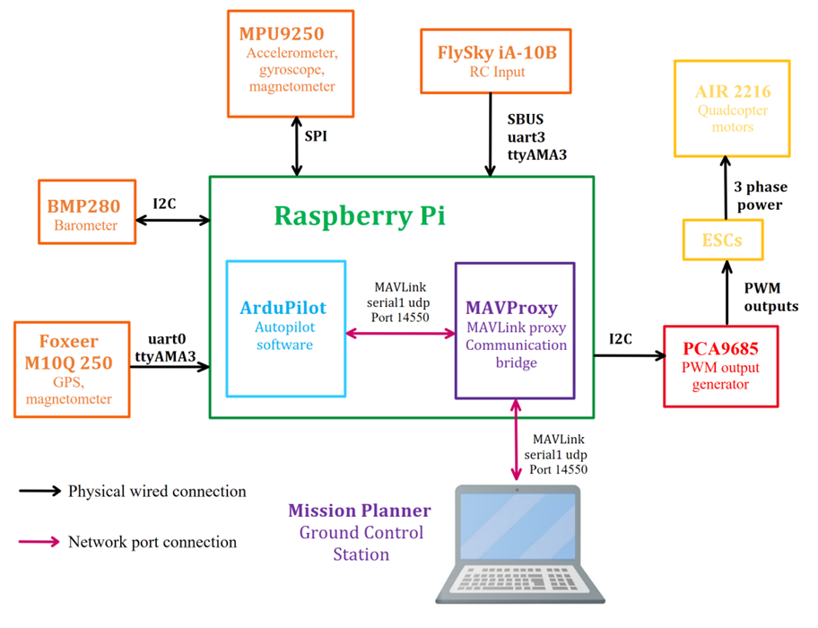
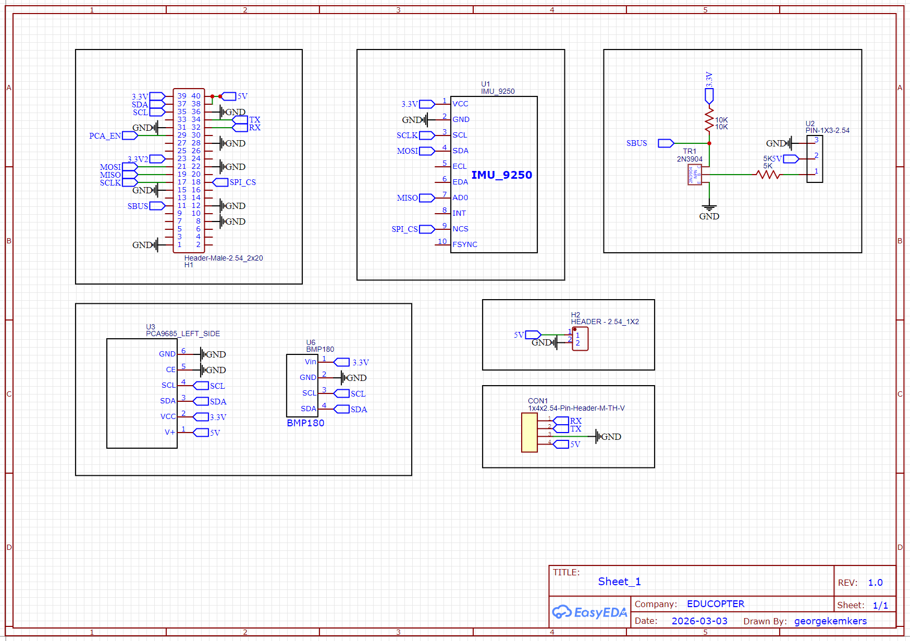
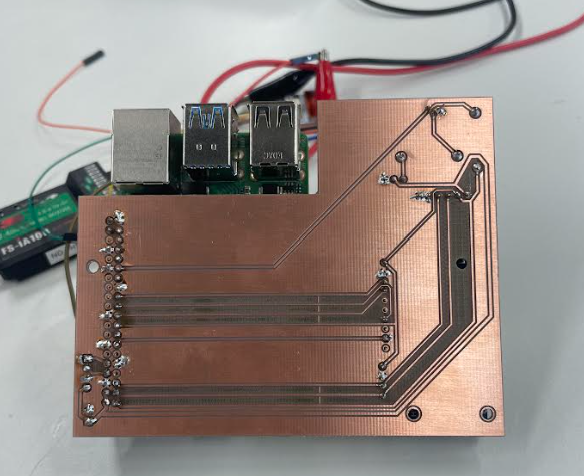
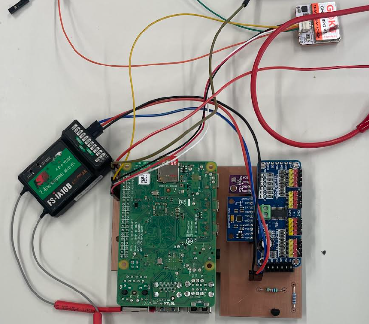

# EDUCOPTER Hardware Setup

This guide explains how to construct and assemble the **EDUCOPTER flight controller hardware**.  
It covers sensor connections, PCB manufacturing, soldering components, connecting peripherals, and powering the system.

The EDUCOPTER board has been intentionally designed to be **simple to manufacture and assemble**, using a **single-sided PCB** and only the sensors required for ArduPilot operation.

---

# 1. Sensor and Peripheral Connections

The EDUCOPTER board uses standard interfaces supported by **ArduPilot on Linux-based flight controllers**. Wherever possible, commonly used pin assignments have been used so that ArduPilot can detect and initialise sensors without extensive configuration.

A summary of hardware components and their communication methods is shown below. The black arrows represent physical connection on the PCB and the pink arrows represent connection via network port.

### Sensor Interface Overview

| Device | Interface | Purpose |
|------|------|------|
| IMU (MPU9250) | SPI | Attitude estimation (gyro + accelerometer) |
| Barometer | I2C | Altitude estimation |
| PCA9685 PWM driver | I2C | Motor PWM outputs |
| GPS module | UART | Position and velocity |
| RC Receiver (SBUS) | UART | Remote control input |

---

### SPI – IMU

The **IMU** is connected using the SPI interface. SPI provides fast and reliable communication required for inertial measurements.

SPI pins include:

- MOSI  
- MISO  
- SCLK  
- CS (chip select)

These are connected to the Raspberry Pi SPI bus using standard Linux ArduPilot mappings.

---

### I2C – Barometer BMP280 and PCA9685

Both the **barometer** and the **PCA9685 PWM driver** are connected using the **I2C bus**.

Advantages of I2C:

- Multiple devices share the same bus  
- Only two signal wires are required

---

### UART – GPS

The GPS module communicates using **UART serial communication**.

| GPS Pin | Connects To |
|------|------|
| TX | Raspberry Pi RX |
| RX | Raspberry Pi TX |
| VCC | 5V |
| GND | Ground |

**Important:**  
GPS **TX must connect to Pi RX**, and **GPS RX must connect to Pi TX**.

---

### UART – SBUS Receiver

The RC receiver uses the **SBUS protocol**, which transmits multiple RC channels over a serial connection.

SBUS can be used on many GPIO pins, but the configuration used in EDUCOPTER is UART0, using pins GPIO14 and 15.

Before use, the UART must be **enabled on the Raspberry Pi**.

The circuit schematic is shown below.

---

# 2. Build the SBUS Inversion Circuit

SBUS signals are **inverted**, whereas the Raspberry Pi UART expects **non-inverted serial data**.

To correct this, a **simple transistor inverter circuit** is used.

### Required Components

| Component | Value |
|------|------|
| NPN transistor | 2N3904 |
| Base resistor | 5 kΩ |
| Pull-up resistor | 10 kΩ |

### Circuit Operation

- SBUS signal enters the **base resistor**
- The transistor switches the signal
- The collector outputs a **non-inverted UART signal**
- The pull-up resistor ensures correct logic levels

This can be seen in the schematic in the box titled 'SBUS Inverter Circuit on UART3'

---

# 3. Manufacture the PCB

The EDUCOPTER PCB is designed to be **single sided**, making it suitable for **PCB milling machines**.

Advantages:

- Easier fabrication
- No vias required
- Suitable for educational environments

### PCB Structure

Two Gerber layers are used:

1. **Bottom copper layer (traces)**
2. **Top insulation layer**

All **traces and solder joints are on the bottom side** of the board, and the top side only electrically insulates the pins in case they touch the copper surface.

### Gerber Files

The gerber files are included in the hardware section of this repository.

---

### PCB Milling

The board used in this project was manufactured using a **Makera Carvera PCB milling machine**.

A **Standard Operating Procedure (SOP)** for using the Carvera can be found on Makera's website or youtube channel.

---

# 4. Solder the Components

Once the PCB has been manufactured, components must be soldered onto the board.

The EDUCOPTER PCB was designed with **approximately 0.35 mm trace spacing**, making it relatively managable for novice solderers.

### Required Tools

- Soldering iron  
- Solder  
- Tweezers  
- Flux (recommended)

All components should be soldered to the pads on the backside of the board, shown in the image below:

---

# 5. Connect the RC Receiver and GPS

External peripherals connect via header pins.

---

### RC Receiver Connection

| Receiver Pin | Connect To |
|------|------|
| SBUS | SBUS input |
| 5V | 5V |
| GND | Ground |

The SBUS signal must pass through the **inversion circuit** before reaching the Pi UART.

---

### GPS Wiring

Correct wiring is essential.

| GPS Pin | Connect To |
|------|------|
| TX | Pi RX |
| RX | Pi TX |
| VCC | 5V |
| GND | Ground |

---

# 6. Power the Circuit

The EDUCOPTER board can be powered in two ways.

---

### Method 1 – PCB Power Pins

The board includes **dedicated 5V input pins**, shown in the 5V 3A Power input box in the circuit schematic.

Connect these to a 5V DC power supply from a regulated power source.

### Method 2 – Raspberry Pi USB-C

The board can also be powered using the Raspberry Pi **USB-C power input**, which is the primary method used for this design. A DC--DC buck converter with a usbc connector on the end is included in the BOM, and details of how to connect this are included in the 'flying' section of this repository.

---

# 7. Final Hardware Checklist

Before powering the board:

✔ Check for solder bridges  
✔ Confirm correct sensor orientation   
✔ Ensure GPS TX/RX wiring is correct  
✔ Confirm correct power polarity  

The completed board is with the GPS and RC receiver units connected is shown below:

---

# Next Step

Once the hardware is assembled and verified, proceed to the **software setup instructions**:
