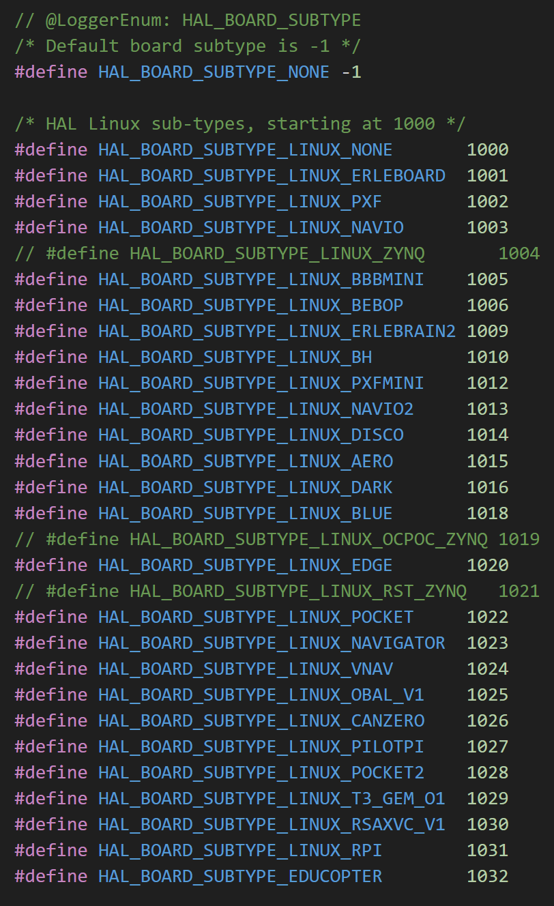
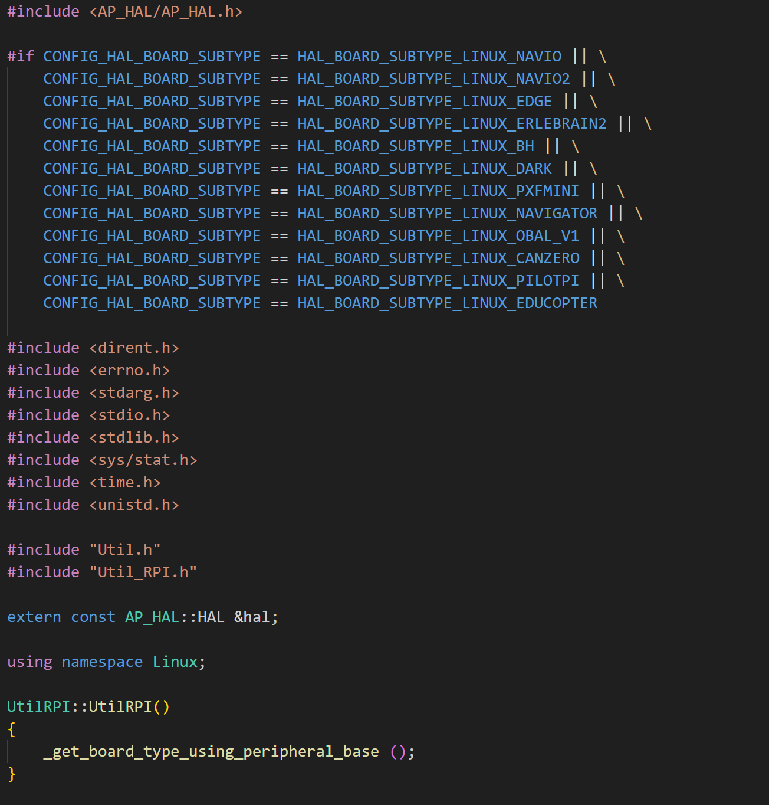
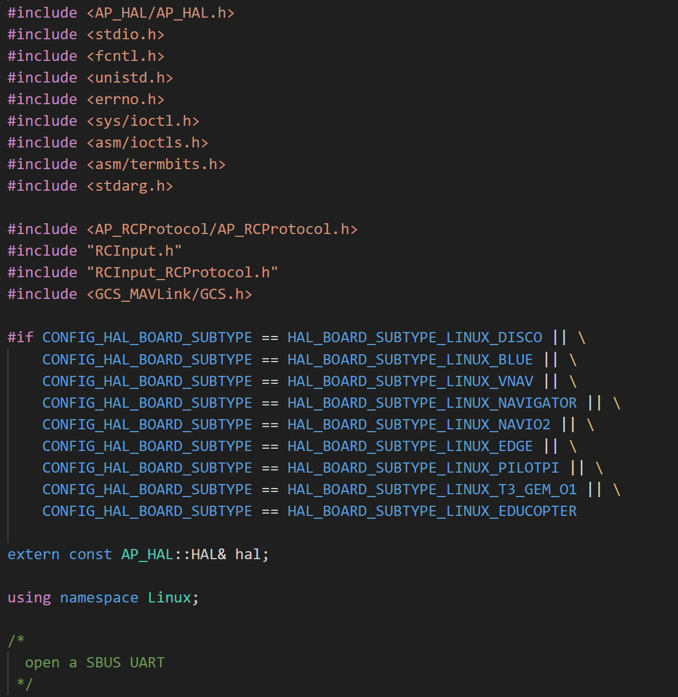
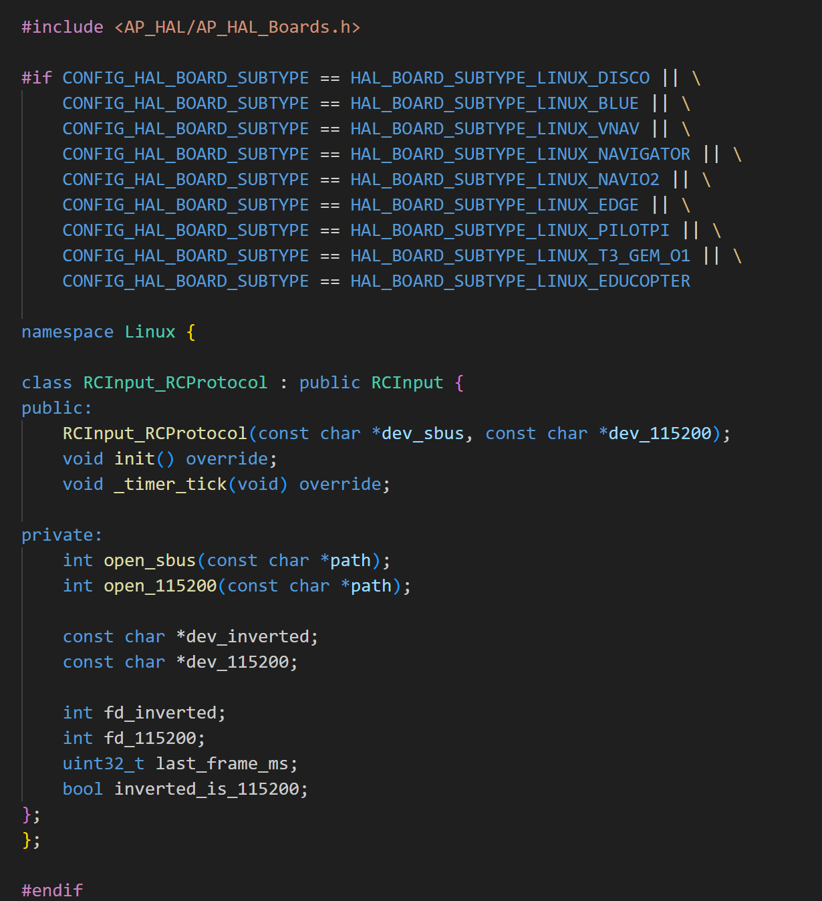

# EDUCOPTER – Running Educopter binary on a Raspberry Pi

This repository documents the software setup required to run **ArduPilot Educopter on a Raspberry Pi** using the custom **EDUCOPTER hardware configuration**.

It includes:

- Raspberry Pi OS installation
- ArduPilot source modifications for the EDUCOPTER board
- Building ArduPilot on a Linux VM
- Copying the build to the Raspberry Pi
- Downloading MAVProxy to the Raspberry Pi
- MAVLink communication with MAVProxy and Mission Planner
- System service configuration

The aim of this readme is to:
1. Allow the reader to directly replictae this project
2. Detail the steps that would enable the creation of a new Linux board

---

# Tips and Tricks

This repository was published in April 2026. Please be aware that ArduPilot may have changed board name definition locations for Linux since this publication. If you find these instructions aren't resulting in a correct binary build, I'd recommend using the grep function in Linux terminal to search for other Linux boards. This way you can see which files and corresponding sections to edit. For example, in your ardupilot directory:

`grep -rn "_OBAL" libraries/`

or

`grep -rn "NAVIO2" libraries/`

Then observe which files these definitions are located in and add your board definitions if necessary.

---

# 1. Preparing the Raspberry Pi

## Install Raspberry Pi OS

Download **Raspberry Pi Imager** from the Raspberry Pi website onto your laptop.

Install the following image:

**Raspberry Pi OS Lite (32-bit)**

The Lite version is recommended because:

- it is lightweight
- it reduces CPU usage
- it avoids unnecessary desktop processes that can slow the ArduPilot main loop

Insert an SD card into a reader and flash the image using the imager.

---

## Naming the Pi

For simplicity and to avoid directory errors in the Pi's terminal, set the following details for the Raspberry Pi

- **Name** 'pi'
- **Password** 'password'

## Enable WiFi using the laptop hotspot

Ensuring the Pi connects to your laptop hotspot makes ssh to Pi possible with the laptop connected to any network

First, change your hotspot settings on your laptop to 2.4GHz band. This is the only band width the Pi can connect to and will cause countless hours of stress and confusement if left at 5GHz!

To allow the Pi to connect to the laptop hotspot during first boot:

1. In Raspberry Pi Imager open **Advanced Options**
2. Enable **WiFi configuration**
3. Enter the hotspot credentials

Example:

- **SSID Name:** `LaptopSSID_name`
- **Password:** `**********`
- **Country:** `GB`

---

## 2. First boot

Insert the SD card into the Raspberry Pi and power it on using the 5V usbc port.

Connect via SSH from your Linux virtual machine's terminal. Find the Pi's IP address by looking in your hotspot's connected devices and enter the following:

`ssh pi@<pi_ip_address>`

e.g.

`ssh pi@192.168.137.119`

Update packages:

`sudo apt update`

`sudo apt upgrade`

---

# 3. Enabling SPI, I2C and UART on the Raspberry Pi

In order to enable the Pi's external pins, run this command in the terminal:

`sudo raspi-config`

Navigate to Interface Options →

Then select the following:
1. SPI → Enable
2. I2C → Enable
3. Serial Port:
  a. Login shell over serial → Disable
  b. Serial hardware → Enable

With these steps completed, reboot the Pi using

`sudo reboot`

---

# 4. Preparing the Build Environment (Linux VM)

ArduPilot is built on a **Linux virtual machine** rather than directly on the Raspberry Pi. This allows faster compilation and avoids installing unnecessary development tools on the Pi, whilst enabling an easy ssh connection. Alternatively ssh can be performed using VSCode.

I used Oracle VirtualBox box to run a version of Ubuntu but you can use any VM that you prefer. The guide for to install Ubuntu on Oracle VirtualBox can be found here:
https://ubuntu.com/tutorials/how-to-run-ubuntu-desktop-on-a-virtual-machine-using-virtualbox

---

# 5. Clone the ArduPilot source code

**IMPORTANT** Clone the ardupilot repository on your Linux virtual machine. When you eventually build the board subtype using waf, this will save time and also keeps the workflow organised. Of course you can clone it straight to the Pi, but building the binary will take approximately 45 minutes on a Pi 5. On a Pi zero, the build would likely take days!

In a terminal on the VM, clone the repository:

`git clone https://github.com/ArduPilot/ardupilot.git`

Enter the directory:

`cd ~/ardupilot`

Initialise the submodules:

`git submodule update --init --recursive`

---

# 6. Adding the EDUCOPTER Hardware Definition

Create the directory:

`ardupilot/libraries/AP_HAL_Linux/hwdef/EDUCOPTER`

You can do this using the command:

`sudo nano ardupilot/libraries/AP_HAL_Linux/hwdef/EDUCOPTER`

Copy the `hwdef.dat` file from this repository into that directory.

This file defines:

- Sensors
- Communication methods (I2C, SPI)
- GPIO mappings
- Board subtype
- Log file directories

used by the EDUCOPTER board.

---

# 7. Required Source Code Modifications

A small number of changes must be made to ArduPilot's Linux HAL so the EDUCOPTER board is recognised correctly.

These modifications allow the system to:

- recognise the new board subtype
- enable Raspberry Pi specific utilities
- configure flight sensors
- configure RC input handling (SBUS)

Only the relevant lines should be changed so that the setup remains easier to maintain when ArduPilot updates.

---

## Modify `AP_HAL_Boards.h`

File:

`libraries/AP_HAL/AP_HAL_Boards.h`

Add a new board subtype definition for EDUCOPTER.

### Why this is needed

This allows ArduPilot to distinguish the board from other Linux targets such as Navio or BeagleBone.

---

## Modify `HAL_Linux_Class.cpp`

File:

`libraries/AP_HAL_Linux/HAL_Linux_Class.cpp`

This file:
- Defines board subtype
-  Maps RC Input Protocol
-  Maps RC Output (signal to the ESCs)

The modification steps are as follows:

1. Add EDUCOPTER board subtype definition
   

2. Add EDUCOPTER RCInputProtocols definition

But what exactly does the line do?

static RCInput_RCProtocol rcinDriver{"/dev/ttyAMA3", nullptr};

This line instantiates the RCInput_RCProtocol driver, which is responsible for reading RC receiver data from a Linux serial device and passing it to ArduPilot’s AP_RCProtocol decoder. This decoder can interpret multiple RC protocols such as iBUS, SBUS and CRSF.

For the EDUCOPTER board, the receiver is connected to the Raspberry Pi UART exposed as /dev/ttyAMA3. The second constructor argument is set to nullptr, indicating that no secondary 115200-baud RC input device is used.

On the Raspberry Pi, /dev/ttyAMA3 corresponds to the UART mapped to GPIO4 and GPIO5, which is used to receive the serial RC data from the receiver. The configuration of this UART is discussed in greater detail in Step X of this README.

3. Add EDUCOPTER RCOutput definition

static RCOutput_PCA9685 rcoutDriver(i2c_mgr_instance.get_device_ptr(1, PCA9685_PRIMARY_ADDRESS), 0, 0, RPI_GPIO_<17>());

This line was written in the OBAL project and has been kept. EDUCOPTER uses the PCA9685 to generate PWM signals to the ESCs, in turn driving the motors. 'RPI_GPIO_<17>()' corresponds to the pin that connects the PCA enable switch. EDUCOPTER has this line grounded to reduce complexity, but the line has been left in for educational purposes

---

## Modify `Util_RPI.cpp`

File:

`libraries/AP_HAL_Linux/Util_RPI.cpp`

Add the EDUCOPTER subtype to the Raspberry Pi utility functions.

### Why this is needed

This allows the board to use Raspberry Pi specific functionality such as:

- GPIO handling
- CPU detection
- system utilities

---

## Modify `RCInput_RCProtocol.cpp`

File:

`libraries/AP_HAL_Linux/RCInput_RCProtocol.cpp`

You must also include the board definition in the .cpp and .h file to use RCInput_Protocol

---

## Modify `RCInput_RCProtocol.h`

File:

`libraries/AP_HAL_Linux/RCInput_RCProtocol.h`

---

# 8. Creating the Python Build Environment

ArduPilot uses **Python tools during compilation**, so the build should be done inside a virtual environment.

Create a virtual environment named `ardupilot-venv`:

`python3 -m venv ardupilot-venv`

Activate it:

`source ardupilot-venv/bin/activate`

Install the required Python packages:

`pip install future`

`pip install empy`

`pip install pyserial`

`pip install pyyaml`

`pip install numpy`

If additional ArduPilot Python dependencies are required on your machine, install them into the same environment.

This part of the process can be quite painful. Syntax errors are common and as ArduPilot continues to develop its code, new dependencies will likely appear. Terminal should prompt you to download the correcr packages when you go to build EDUCOPTER or your own custom Linux board.

---

# 9. Building ArduPilot

**First** make sure that you have saved all changes in the source code, and that you've created hwdef.dat in the correct directory.

Then from inside the ArduPilot directory, with the virtual environment activated, wipe any previous builds and configure the build for the EDUCOPTER board:

`./waf distclean`

`./waf configure --board=EDUCOPTER`

Then build ArduCopter:

`./waf copter`

If successful, the binary will appear at:

`build/EDUCOPTER/bin/arducopter`

### Why a virtual environment is used

Using a dedicated Python environment avoids conflicts with system Python packages and keeps the build reproducible.

**NOTE**
To build a custom board, replace EDUCOPTER with the name of your board defined in the source code edits. Remember to be be case sensitive!

---

# 10. Copying the Binary to the Raspberry Pi

Use `scp` to transfer the binary to the Raspberry Pi:

`scp build/EDUCOPTER/bin/arducopter pi@<pi_IP_address>:/home/pi/`

The binary is now ready on the Pi.

---

# 11. Installing MAVProxy on the Raspberry Pi

MAVProxy is a python application and is used for MAVLink communication with the arducopter binary and a ground control station like Mission Planner. It is not strictly necessary but is helpful for streamlining communication and debugging. I would highly recommend using it for EDUCOPTER and any other board you may build.

Create a Python virtual environment on the Pi named `mavproxy-venv`:

`python3 -m venv mavproxy-venv`

Activate it:

`source mavproxy-venv/bin/activate`

Install MAVProxy:

`pip install MAVProxy`

If required, install any supporting Python packages into the same environment.

Ardupilot documentation lists the modules usually required, but like the previous python package downloads performed in the venv inside the Linux VM, this process can be tricky and demands patience.

---

# 12. MAVLink Communication

ArduPilot sends MAVLink telemetry to MAVProxy and Mission Planner over UDP or TCP. In this project UDP is used because it provides a lightweight, low-latency connection suitable for real-time telemetry streaming. You dob't need to run any of this sections code in the Pis terminal; it purely exists for educational purposes.

Example configuration in `ardupilot.service`:

`--serial1 udp:0.0.0.0:14550`

This allows MAVProxy or Mission Planner to connect.

Example MAVProxy command:

`mavproxy.py --master=udp:127.0.0.1:14550`

---

# 13. Systemd Service

The repository includes an example `ardupilot.service` file.

Copy it to:

`/etc/systemd/system/`

You should now have the directory:

`/etc/systemd/system/ardupilot.service`

Enable the service:

`sudo systemctl enable ardupilot`

Start it:

`sudo systemctl start ardupilot`

Check the status:

`sudo systemctl status ardupilot`

**NOTE** If you make any changes to the .service file after originally writing it, you must reload the file before using it:

`sudo systemctl daemon-reload`

---

# 14. Parameter File

The repository also includes an `ardupilot.parm` file.

Copy it to the location expected by the binary, for example:

`/home/pi/ardupilot.parm`

This file contains the startup parameters required for the EDUCOPTER configuration, including telemetry and GPS serial settings.

# 15. Download Mission Planner on your PC

Click the ArduPilot documentation link below to download Mission Planner for your Operating System. Don't do this on your Linux VW, download it straight onto your laptop.

https://ardupilot.org/planner/docs/mission-planner-installation.html

Once downloaded, follow the steps until you reach the main page and leave it for now.

# 16. Running ardupilot and MAVProxy

If you've made it to this step, congratulations! You're ready to run your built binary on the Pi and connect it via MAVProxy to Mission Planner. Follow these steps in order:

1. Check that ardupilot is running:

`sudo systemctl status ardupilot`

If it isn't, restart it and check the status again:

`sudo systemctl restart ardupilot`
`sudo systemctl status ardupilot`

2. Run MAVProxy and connect to ardupilot and Mission Planner:

`mavproxy.py --master=udp:127.0.0.1:14550 --out=udp:<laptop_IP_address>:14550`

Make sure to insert the IP address of whatever device is running Mission Planner. For example:

`mavproxy.py --master=udp:127.0.0.1:14550 --out=udp:192.168.137.1:14550`

Whilst the Pi isn't connected to the physical board, you will get Barometer erros and likely lots of binary symbols displaying on your screen. This is normal and will go away when the board is connected.

3. On your laptop, open Mission Planner and connect to MAVProxy via UDP port 14550. The connect icon is on the top left of the screen.

Without the Pi connected to the board, no telemetry data will appear in the Mission Planner dashboard. In messages, you will see MAVProxy displaying the same errors you saw previously.

But congratulations! You've set up the software for EDUCOPTER and you're ready to connect your board!

This next step is detailed in the README.md document located in the 'flying' folder.

---

# Notes

This repository documents the **software setup only**. Hardware wiring, PCB layout, power distribution, and sensor integration are documented in the README.md in the hardware section of this repository.

Where ArduPilot source files must be edited, only the relevant changes should be documented rather than copying entire upstream files. This makes the instructions more robust to future ArduPilot updates.

All images in these instructions are located in /software/images for reference.
