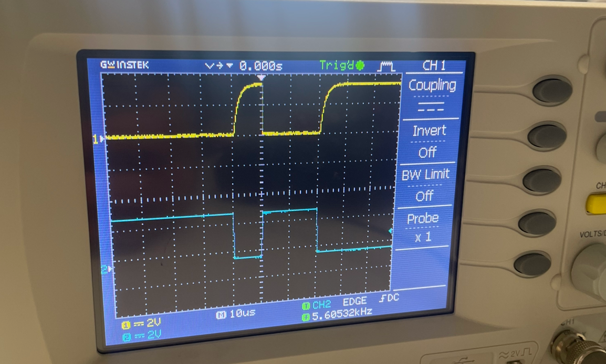

## Testing the board for I2C and SPI detection, and UART verification ##

When porting a new board to ArduPilot, several changes are required in the Linux HAL source code. As a result, configuration mistakes are common and can be difficult to diagnose. This section provides a systematic hardware verification procedure to rule out wiring faults or configuration errors before debugging the software.

---

##  Hardware Verification ##

The first step in troubleshooting is to verify the hardware functionality and wiring. This can be done by checking whether the Raspberry Pi detects the barometer, IMU, PCA9685 PWM driver, RC receiver and GPS module.

## 1. I2C device tests ##

The two devices connected via I2C are the PCA9685 and the BMP280 barometer. They can be detected on the I2C bus using the i2c-tools package:

`sudo apt update`

`sudo apt install i2c-tools`

Then check that i2c exists by running the following command:

`ls /dev/i2c*`

This should return /dev/i2c-1. If the terminal replies with nothing, this is most likely due to I2C not being enabled. Follow step X in the software README file to enable I2C.

The I2C devices can then be detected using:

`sudo i2cdetect -y 1`

This should show two devices on the I2C bus as in the image below. The BMP280 should be on the 0x76 address and the PCA9685 on the 0x40.

If these devices do not appear during the I2C scan, this may be due to several hardware or wiring issues:

| Problem | Solution |
|--------|----------|
| Devices are not the expected model (e.g. BMP180 instead of BMP280) | Verify the exact sensor part number printed on the module. Some breakout boards look similar but use different I2C addresses and drivers. |
| Components are not receiving power | Check for solder bridges or damaged PCB traces. Use a digital multimeter to confirm ~3.3 V between Vcc and GND on each device. |
| Components are faulty | Replace the device or test with a known working module to confirm whether the sensor is damaged. |

## 2. SPI device tests ##

Detecting SPI devices on a Raspberry Pi 4 is different from I2C. There is no equivalent to i2cdetect for SPI because SPI devices do not have addresses. 

First, confirm that the SPI interface exists:

`ls /dev/spidev*`

If this returns nothing, follow the same step X in the software section and return to this point.

Next, install the SPI testing tool:

`sudo apt update`

`sudo apt install python3-spidev`

Run the following in your terminal:

`python3 - <<EOF
import spidev
spi = spidev.SpiDev()
spi.open(0,0)
spi.max_speed_hz = 1000000
print(hex(spi.xfer2([0x75 | 0x80, 0x00])[1]))
EOF`

The expected output is 0x71 for an IMU9250. If the device does not appear during the I2C scan, this may be due to several hardware or wiring issues:

| Problem | Solution |
|--------|----------|
| Device is not the expected model eg GY91 | Verify the exact sensor part number printed on the module. |
| Component is not receiving power | Check for solder bridges or damaged PCB traces. Use a digital multimeter to confirm ~3.3 V between Vcc and GND on each device. |
| The CS pin isn't connected (common when porting your own board) | Make sure to redesign the PCB with the CS pin connected to CS0 or CS1 of the Pi |
| Component is faulty | Replace the device or test with a known working module to confirm whether the sensor is damaged. |

## 3. UART device tests ##

## a. RC Receiver ##

The RC receiver transmits using SBUS protocol which is inverted by the EDUCOPTER board. The inversion can be tested using an oscilloscope and connecting both contacts with the input and output of the inversion circuit. The results should show a waveform like in the image below:

Bytes verification can then be conducted. First, confirm the correct uart ports are enabled:

`ls /dev/ttyAMA*`

AMA3 and AMA0 should appear as both are used for the EDUCOPTER design.

