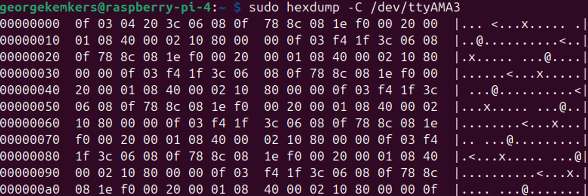

## Testing the board for I2C and SPI detection, and UART verification ##

When porting a new board to ArduPilot, several changes are required in the Linux HAL source code. As a result, configuration mistakes are common and can be difficult to diagnose. This section provides a systematic hardware verification procedure to rule out wiring faults or configuration errors before debugging the software.

---

##  Hardware Verification ##

The first step in troubleshooting is to verify the hardware functionality and wiring. This can be done by checking whether the Raspberry Pi detects the barometer, IMU, PCA9685 PWM driver, RC receiver and GPS module.

## 1. I2C device tests ##

The two devices connected via I2C are the PCA9685 and the BMP280 barometer. They can be detected on the I2C bus using the i2c-tools package:

`sudo apt update`

`sudo apt install i2c-tools`

Then check that i2c exists by running the following command:

`ls /dev/i2c*`

This should return /dev/i2c-1. If the terminal replies with nothing, this is most likely due to I2C not being enabled. Follow step X in the software README file to enable I2C.

The I2C devices can then be detected using:

`sudo i2cdetect -y 1`

This should show two devices on the I2C bus as in the image below. The BMP280 should be on the 0x76 address and the PCA9685 on the 0x40.

If these devices do not appear during the I2C scan, this may be due to several hardware or wiring issues:

| Problem | Solution |
|--------|----------|
| Devices are not the expected model (e.g. BMP180 instead of BMP280) | Verify the exact sensor part number printed on the module. Some breakout boards look similar but use different I2C addresses and drivers. |
| Components are not receiving power | Check for solder bridges or damaged PCB traces. Use a digital multimeter to confirm ~3.3 V between Vcc and GND on each device. |
| Components are faulty | Replace the device or test with a known working module to confirm whether the sensor is damaged. |

## 2. SPI device tests ##

Detecting SPI devices on a Raspberry Pi 4 is different from I2C. There is no equivalent to i2cdetect for SPI because SPI devices do not have addresses. 

First, confirm that the SPI interface exists:

`ls /dev/spidev*`

If this returns nothing, follow the same step X in the software section and return to this point.

Next, install the SPI testing tool:

`sudo apt update`

`sudo apt install python3-spidev`

Run the following in your terminal:

`python3 - <<EOF
import spidev
spi = spidev.SpiDev()
spi.open(0,0)
spi.max_speed_hz = 1000000
print(hex(spi.xfer2([0x75 | 0x80, 0x00])[1]))
EOF`

The expected output is 0x71 for an IMU9250. If the device does not appear during the I2C scan, this may be due to several hardware or wiring issues:

| Problem | Solution |
|--------|----------|
| Device is not the expected model eg GY91 | Verify the exact sensor part number printed on the module. |
| Component is not receiving power | Check for solder bridges or damaged PCB traces. Use a digital multimeter to confirm ~3.3 V between Vcc and GND on each device. |
| The CS pin isn't connected (common when porting your own board) | Make sure to redesign the PCB with the CS pin connected to CS0 or CS1 of the Pi |
| Component is faulty | Replace the device or test with a known working module to confirm whether the sensor is damaged. |

N.B. In regards to the chip select pin, it was found that any connection error with the IMU resulted in ArduPilot refusing to connect with MAVProxy over network connection. If you are experiencing this issue, this could be the problem.

## 3. UART device tests ##

## A. RC Receiver ##

The RC receiver transmits using SBUS protocol which is inverted by the EDUCOPTER board. The inversion can be tested using an oscilloscope and connecting both contacts with the input and output of the inversion circuit. The results should show a waveform like in the image below:

Bytes verification can then be conducted. First, confirm the correct uart ports are enabled:

`ls /dev/ttyAMA*`

ttyAMA0 for the GPS and ttyAMA3 for the RC receiver should appear. 

Next, turn on the RC transmitter (the controller) and connect to the receiver using the standard connection protocol. For the FlySkyiA10B used in this project, a bidnig plug is used for this process. Folow the instructions on FlySky's website or using youtube.

Then scan for SBUS bytes:

`sudo hexdump -C /dev/ttyAMA3`

The expected output is shown in the image below:

If this doesn't appear AND the circuit has already been tested using thge oscilliscope, the issues could be:

| Problem | Solution |
|--------|----------|
| The receiver isn't configured for SBUS (very common) | Follow the manual for your particular receiver and transmiitter pair to set up SBUS |
| Component is not receiving power | Check for light from the receiver. The FS iA10B trasnmits a solid red light when binded |
| Component is faulty | Replace the device or test with a known working module to confirm whether the receiver is damaged. |

## B. GPS module ##

A similar process of detecting UART input bytes can be done with the GPS module. Follow the steps described previously but instead use this command:

`sudo hexdump -C /dev/ttyAMA0`

This project found that when the GPS module was not connected to satellites, this method of testing could appear unreliable (where the GPS sometimes outputted nothing to terminal). The main isses with GPS moudles were found in ardupilot.parm, which will be discussed next.

---

## Software verification

If the previous steps were completed successfully for all components, hardware and wiring issues can largely be ruled out. Any remaining problems are therefore likely to originate from the EDUCOPTER binary configuration or the `ardupilot.service` and `ardupilot.parm` files.

There are many ways in which a Linux board can be incorrectly ported in ArduPilot, so it is not possible to cover every issue here. However, several recommendations are provided below based on experience gained during this project.

---

## 1. Use `grep` to inspect existing Linux board builds

To see examples of how other Linux boards define their hardware configuration, use the `grep` command to search the ArduPilot source tree for existing Raspberry Pi–based boards such as Navio2 and OBAL.

For example:

`grep -rn "_OBAL" ~/ardupilot/libraries/`

`grep -rn "NAVIO2" ~/ardupilot/libraries/`

These commands identify the files in which these board definitions appear and help locate the relevant configurations used during compilation.

Reviewing these examples can provide guidance when defining new board subtypes in the Linux HAL.

You can also refer to the ArduPilot architecture diagram located in the **Future Research** folder to identify which files are commonly modified during board porting.

---

## 2. Inspect board definitions in the ArduPilot GitHub repository

Another useful debugging approach is to browse the ArduPilot GitHub repository directly and examine how existing Linux boards are implemented.

Navigate to the relevant files and search for board subtype definitions and `#if` preprocessor directives to understand how these configurations are applied during compilation. This helps identify where hardware-specific logic is selected when building the vehicle firmware binary.

## 3. Check the `.service` and `.parm` files

These files are responsible for configuring how ArduPilot accesses UART devices on the Raspberry Pi.

For the EDUCOPTER build, the GPS configuration was handled primarily through these files, as is common with many ArduPilot Linux builds. The `ardupilot.service` file maps ArduPilot SERIAL ports to physical Raspberry Pi serial devices, so it is important to ensure that the correct serial interfaces are used.

Things to check:

1. GPS protocol is set correctly:

   `SERIAL3_PROTOCOL = 5`

   This enables the GPS driver on SERIAL3.

2. The correct baud rate is configured:

   `SERIAL3_BAUD = 115`

   The GPS module used in this project operates at 115200 baud. Other modules may require a different baud rate, so consult the module documentation if communication fails.

3. GPS auto-detection is enabled:

   `GPS_TYPE = 1`

   This allows ArduPilot to automatically detect the connected GPS module.

---

## Final advice

If errors persist after following these steps, consider reaching out to the ArduPilot community through the ArduPilot Discord server or the ArduPilot Discuss forum. The community is active and very supportive of new hardware porting efforts.

